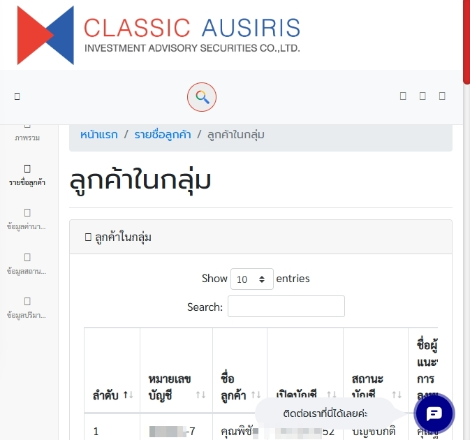
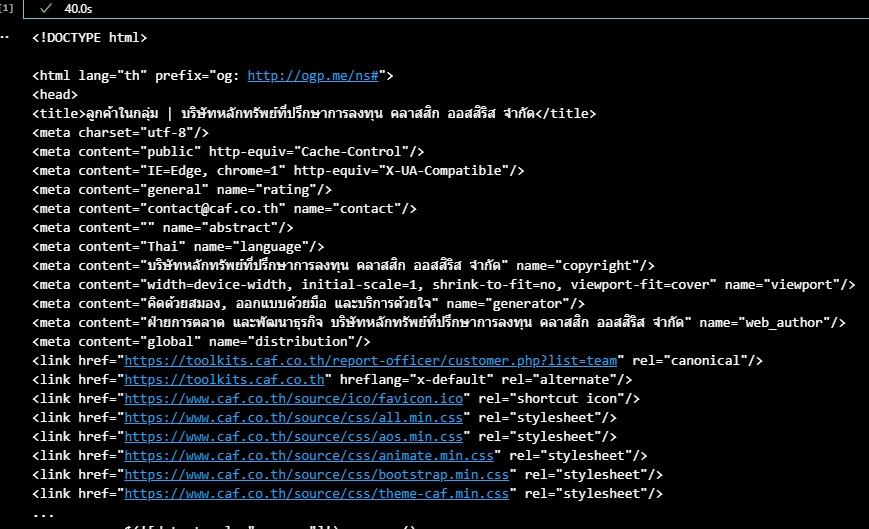
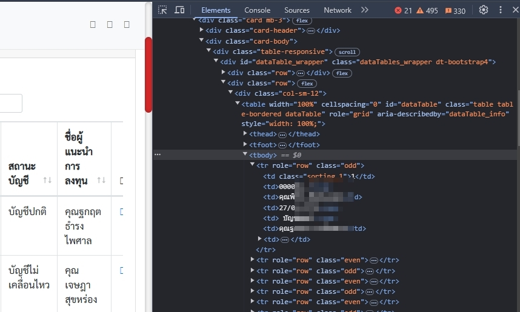
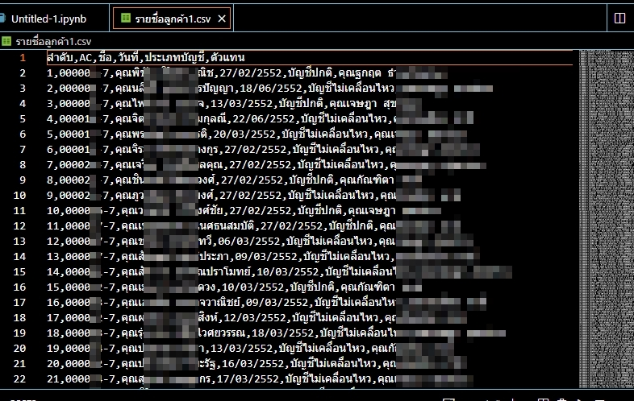

## Scrap-Static-Website

## Scrape ข้อมูลลูกค้าจากหน้าเว็บ
เราจะเขียน Python Script เพื่อดึงข้อมูลจากหน้าเว็บบริษัท(CAF) และนำข้อมูลไปเก็บใส่ Google Sheets เพื่อใช้เป็น Data Source ในการทำ Dashboard




## flowchart

## Tools

1. Python (ในตัวอย่างจะใช้ Version 3.13.1 / ระบบปฏิบัติการ windows 11)
2. Library ที่ต้องลงเพิ่ม
    1. requests
    2. Pandas
    3. BeautifulSoup4
    4.

3. Visual Studio Code

## Process

1. ใช้ requests เพื่อ login หน้าเว็บ สำหรับพนักงานของ(CAF)
2. ใช้ BeautifulSoup4 อ่าน HTML จากหน้าเว็บ (CAF)
3. ใช้ Pandas สร้างตาราง จาก HTML
4. นำข้อมูลใส่ CSV
 
 #### 1. ใช้ requests เพื่อ login หน้าเว็บ สำหรับพนักงานของ(CAF)

- สร้าง session เก็บข้อมูลของ username , password
- จากนั้นใช้ session. post จะใช้สำหรับการส่งข้อมูลไปยัง server ในที่นี้คือ username , password
- สร้างตัวแปรสำหรับ URL ของหน้าเว็บที่ต้องการดึงข้อมูล
- ส่ง request เพื่อเข้าถึงข้อมูลของหน้าเว็บ

```  python

import requests

login = 'URL'

session = requests.Session()

login_data = {'username': '*******','password': '******'}

session.post(login, data=login_data)

url = 'URL'

req = session.get(url)

```

##### 2. ใช้ BeautifulSoup4 อ่านข้อมูล จาก HTML


- ใช้ BeautifulSoup4 สกัดข้อมูลหน้าเว็บ


```  python

from bs4 import BeautifulSoup
soup = BeautifulSoup(response.content, 'html.parser')

```




- จะเห็นได้ว่าจะไม่เห็นข้อมูลอะไรเลย
- ดังนั้นต้องแก้ไขปัญหาด้วยการ ดู syntax ที่หน้าเว็บที่ต้องการแล้วค่อยทำการสกัดข้อมูล
- ดู syntax ที่หน้าเว็บ
- ดึงข้อมูลจากหน้าเว็บมาเก็บ
- สร้าง list ว่างเพื่อมาเก็บข้อมูล




```  python

syntax = soup.find_all('tr')  

data = []
for row in syntax:
    a = row.find_all('td')
    if len(cols) >= 6:
        data.append({
            'ลำดับ': a[0].text.strip(),
            'AC': a[1].text.strip(),
            'ชื่อ': a[2].text.strip(),
            'วันที่': a[3].text.strip(),
            'ประเภทบัญชี': cols[4].text.strip(),
            'ตัวแทน': a[5].text.strip()
        })

```

#### 3.ใช้ Pandas สร้างตาราง

```  python

from bs4 import BeautifulSoup
soup = BeautifulSoup(response.content, 'html.parser')

```
### 4.นำข้อมูลใส่ csv

```  python

from bs4 import BeautifulSoup
soup = BeautifulSoup(response.content, 'html.parser')

```
